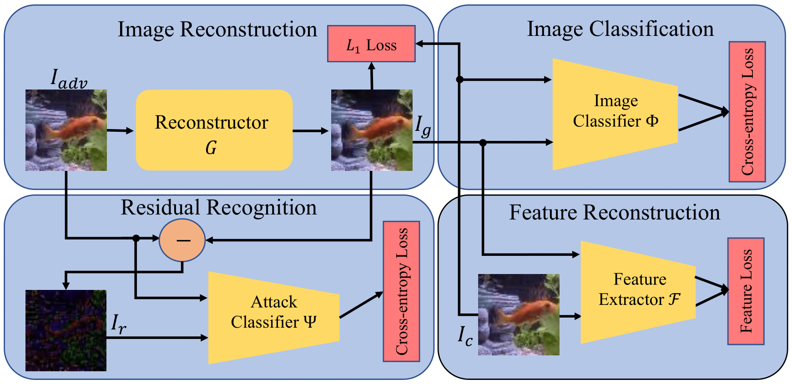

# Identifying Attack-Specific Signatures in Adversarial Examples
This repository is the official implementation of the [Identifying Attack-Specific Signatures in Adversarial Examples](https://ieeexplore.ieee.org/abstract/document/10446989). 

<p align="center">
  
</p>

## Getting Started 

Clone this repository into a directory of your choosing with the following command:

```
cd path/to/your/directory/
git clone https://github.com/hsouri/REDRL
```

Next go into the cloned directory `cd ./REDRL` and create a directory for future checkpoints by the following command:

```
mkdir checkpoints
```

At this point the repository structure should be ready. In the next step make sure that the provided path to the pre-trained image classifiers models and the data is correct in the `./tools/path.py` script. If not modify them accordingly.

To start trainig the pipeline go to `./experiment_scripts/` and run the following command:

```
sh $dataset_train.sh
```

Before start to train, make sure all the settings such as involved loss functions, their weights, and etc are the ones you would want. 

<!-- Also note that currently only `CIFAR10` dataset has all the training data.   -->


## Citations

Please cite our paper:

```
@inproceedings{souri2024identifying,
  title={Identifying Attack-Specific Signatures in Adversarial Examples},
  author={Souri, Hossein and Khorramshahi, Pirazh and Lau, Chun Pong and Goldblum, Micah and Chellappa, Rama},
  booktitle={ICASSP 2024-2024 IEEE International Conference on Acoustics, Speech and Signal Processing (ICASSP)},
  pages={7050--7054},
  year={2024},
  organization={IEEE}
}
```
